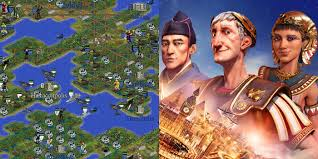

# 💰 Challenge de groupe, l'utopie Économique – Simuler une Économie Basée sur le Bien-Être

Les points sont doublés pour ce challenge collaboratif exceptionnel : **70 € distribués aux lauréats** !

**Dates** : du 01/12/24 au 22/12/24

**Difficulté** : Complexe

**Technologies** : Java 17+ ou Kotlin



## Description
Vous devez simuler l'évolution d’une civilisation futuriste alternative, qui cherche à maximiser le bien-être de sa population tout en gérant efficacement ses ressources. Votre mission est de créer un algorithme permettant de prendre des décisions optimales sur l'allocation des ressources, les priorités de développement, et les échanges avec d’autres civilisations. Ce système doit s’adapter dynamiquement aux besoins changeants et potentillement (option) aux événements imprévus.
Vous pouvez imaginer cela comme le moteur d'un jeu comme Civilization. 

## Objectif
1. Modélisation des ressources et des besoins :
  - Ressources disponibles : Eau, nourriture, énergie, matériaux de construction, etc.
  - Besoins de la population : Santé, éducation, logements, loisirs. Chaque besoin a un niveau de priorité qui peut évoluer.
2. Simulation de l’évolution des besoins :
  -Implémentez un système où la population et ses besoins évoluent au fil du temps (croissance démographique, Bonus: événements aléatoires comme des catastrophes ou des découvertes technologiques).
  - Les ressources doivent être consommées pour satisfaire les besoins, et leur disponibilité peut fluctuer.
3. Algorithme de gestion :
  - Créez un algorithme qui décide :
    - Comment allouer les ressources disponibles en fonction des besoins prioritaires
    - Quels projets de développement lancer, par exemple construire une école, investir dans les énergies renouvelables, ou développer un système de santé.
    - Quand commercer avec d’autres civilisations pour compenser des pénuries ou excédents.
- L’algorithme doit prendre en compte :
  - La maximisation du bien-être général.
  - La durabilité à long terme.
4. Interface utilisateur :
  - Permettez à l’utilisateur de :
    - Voir la progression de l’état des ressources, besoins, et indicateurs au fil des ans (console)
  - Les paramètres de l'algorithme seront configurés au départ, mais doivent pouvoir être facilement modifiés avant de lancer une nouvelle simulation.

## Exemple de visulation par tour

Chaque tour correspond à une année dans la simulation. Voici un exemple de visualisation simplifiée des données affichées après chaque tour.

```dos
Tour 12 : Rapport Annuel
Population : 12,345 habitants (+2%)
Bien-être global : 78% (+3%)
Ressources disponibles :
  - Nourriture : 12,000 unités (+10%)
  - Eau : 8,500 unités (-5%)
  - Énergie : 3,200 unités (+8%)
  - Matériaux de construction : 1,500 unités (-10%)
  ...
```

## Algorithmique

Les résultats doivent être prédictifs (pas de ML).
A chaque tour, l'algorithme doit utiliser des ressources dans un but précis, via des règle d'évolutions générales et des projets particulier, déclencher lorsque certains indicateurs sont atteints.
** Règle d'évolution générale :**
- Chaque personne consomme 1 unité de nourriture par an
** Projet particulier :**
- Investir dans des usines de recyclage pour compenser la baisse d’eau (-100 energie au départ, -50 matériaux au départ, -50 énergie par an).
- Commencer le projet "Parc urbain" pour améliorer le moral ...

Le bien-être sera calculé avec la formule de votre choix, exemple:
- Bien-être global = 0.4 × Santé + 0.3 × Éducation + 0.2 × Logement + 0.1 × Loisirs

## Bonus

1. Événements dynamiques :
  - Intégrez des événements aléatoires comme des catastrophes, des progrès scientifiques, ou des nouvelles alliances.
2. Interactions avec d’autres civilisations :
  - Ajoutez une mécanique de négociation où les civilisations échangent des ressources ou collaborent sur des projets communs.
3. Optimisation avancée :
  - Implémentez un algorithme d’optimisation plus complexe (par exemple, un algorithme génétique ou un simulateur Monte Carlo).

## Récompenses
- Vainqueur : 40 pts
- 2ème : 20 pts
- 3ème : 10 pts

Rappel: Les participants accumulent des points en fonction de leur performance dans les challenges. Ces points peuvent être convertis en cartes cadeaux Prezzy, utilisables pour des achats en ligne ou en magasin dans n'importe quelle devise.

💬 **N'oubliez pas** de poser vos questions sur le serveur Discord pour toute clarification ou aide sur ce challenge. Bonne chance à tous et amusez-vous bien ! 🎉
